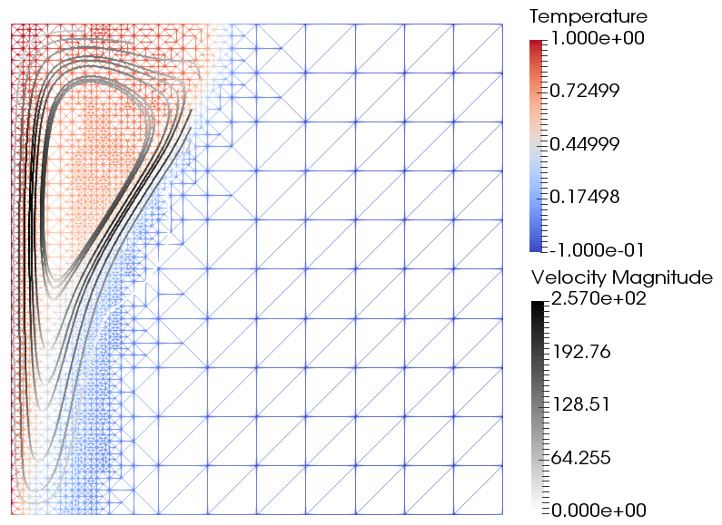
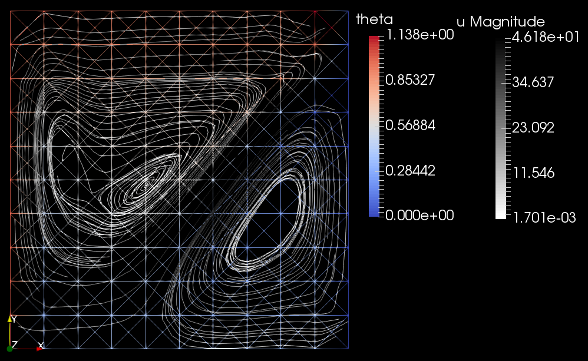

# phaseflow-fenics
 
Phaseflow simulates the convection-coupled melting and solidification of phase-change materials (PCM's). We adopt an enthalpy-based, single-domain semi-phase-field, finite element method, with monolithic system coupling and global Newton linearization.

The model system is composed of
- Incompressible flow driven by buoyancy: unsteady Navier-Stokes mass and momentum with Boussinesq approximation
- Convection-diffusion of the enthalpy field, with an enthalpy source term accounting for the latent heat of the phase-change material

Phaseflow spatially discretizes the PDE's with the finite element method, and to this end uses the Python/C++ finite element library [FEniCS](https://fenicsproject.org/). Many other features are provided by FEniCS, including the nonlinear (Newton) solver, goal-oriented adaptive mesh refinement, and solution output to HDF5, among others.

We present the mathematical model, the numerical methods, the Phaseflow implementation and its verification in a submitted proceedings paper, [*Monolithic simulation of convection-coupled phase-change - verification and reproducibility*](https://arxiv.org/abs/1801.03429).

Author: Alexander G. Zimmerman <zimmerman@aices.rwth-aachen.de>

 (<b>Continuous integration status</b>; click the button to go to Travis-CI)

## Current capabilities
- Unsteady incompressible flow

    Benchmark: Lid-driven cavity
    
    

- Thermal convection

    Benchmarks: Heat-driven cavity (left), natural convection of water (right)
    
     
    
- Phase-change

    Benchmark: 1D Stefan problem (i.e. melting without convection)
    
    
    
- Convection-coupled melting 

    Benchmark: Convection-coupled melting of an octadecane PCM
    
    

    
# For users:
## [Docker](https://www.docker.com)

The FEniCS project provides a [Docker image](https://hub.docker.com/r/fenicsproject/stable/) with FEniCS and its dependencies already installed. See their ["FEniCS in Docker" manual](https://fenics.readthedocs.io/projects/containers/en/latest/). Our [custom Docker image for Phaseflow](https://hub.docker.com/r/zimmerman/phaseflow-fenics/) only adds a Phaseflow installation including any missing dependencies.

Get the [free community edition of Docker](https://www.docker.com/community-edition).
    
## Run Phaseflow in Docker
Pull the image and run the container with Docker

    docker run -ti zimmerman/phaseflow-fenics:latest

Pull the latest version of the master branch

    cd ~/phaseflow-fenics
    
    git pull

Run tests

    python3 -m pytest -v -s -k "not debug"

## Some Docker details
To share a folder between the host container, and to name the container for future use (with start/stop), enter

    docker run -ti -v $(pwd):/home/fenics/shared --name phaseflow-fenics zimmerman/phaseflow-fenics:latest

To enter a bash terminal inside of the running container
    
    docker exec -ti -u fenics phaseflow-fenics /bin/bash -l
    
Note that the "-u fenics" logs into the machine as the "fenics" user.

Our Docker image has phaseflow installed, so in your own Python scripts you can

    import phaseflow

but in this case you should make sure to install the latest version with

    cd ~/phaseflow-fenics
    
    git pull
    
    pip3 install --user --upgrade .

# For developers:
## Project structure
This project mostly follows the structure suggested by [The Hitchhiker's Guide to Python](http://docs.python-guide.org/en/latest/)

## Updating the Docker image
We mostly follow the [Docker getting started instructions](https://docs.docker.com/get-started/part2/#build-the-app).

Edit the Dockerfile, then

    docker build -t phaseflow-fenics .
    
    docker tag phaseflow-fenics zimmerman/phaseflow-fenics:latest
    
    docker push zimmerman/phaseflow-fenics:latest
