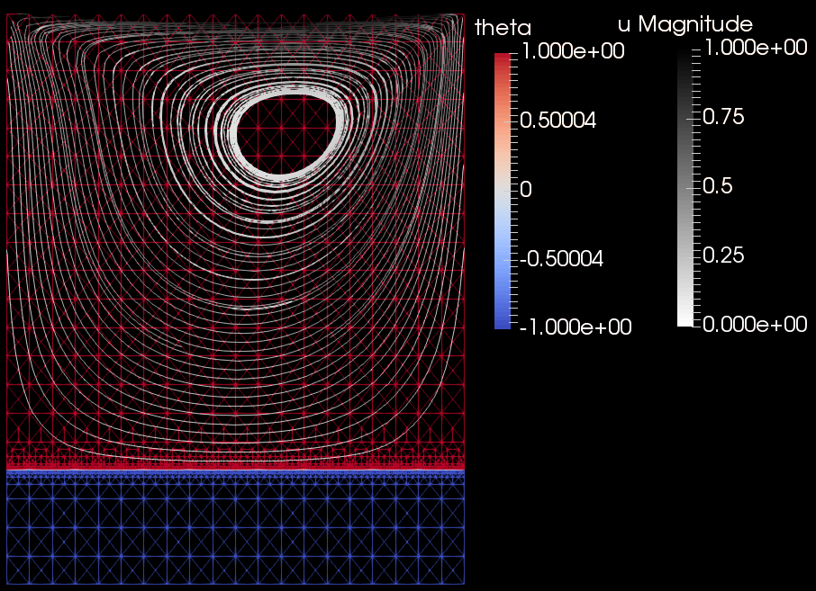

# phaseflow-fenics
Phaseflow simulates the unsteady conservation of mass, momentum, and energy for an incompressible fluid using the Python finite element library FEniCS.

Currently only a homogeneous fluid is supported. The project is currently under heavy development to support phase-change materials, particularly the melting and freezing of water-ice.

Author: Alexander G. Zimmerman <zimmerman@aices.rwth-aachen.de>

 (<b>Continuous integration status</b>; click the button to go to Travis-CI)

## Current capabilities
- Unsteady incompressible Navier-Stokes

    Benchmark: Lid-driven cavity
    
    

- Thermal convection: the momentum equation includes a temperature-based bouyancy force per the Boussinesq approximation

    Benchmark: Natural convection of air
    
    
    
- Nonlinear bouyancy

    Benchmark: Natural convection of water
    
    
    
- Phase-change: The energy equation written in enthalpy form, with latent heat sources/sinks from the phase-change

    Benchmark: Stefan problem
    
    
    
- Variable viscosity: Apply the same momentum equation throughout the single phase-change material domain

    Test: Analogy of lid-driven cavity
    
    
    
- Monolithic coupling of all of the above features

    Qualitatively correct, still need to reproduce benchmark
    
    

# For users:
## [Docker](https://www.docker.com)

The FEniCS project provides a [Docker image](https://hub.docker.com/r/fenicsproject/stable/) with a pre-configured Python environment and pre-built fenics. See their ["FEniCS in Docker" manual](https://fenics.readthedocs.io/projects/containers/en/latest/). Our [custom Docker image for Phaseflow](https://hub.docker.com/r/zimmerman/phaseflow-fenics/) only adds a Phaseflow installation including any missing dependencies.

Get the [free community edition of Docker](https://www.docker.com/community-edition).

Pull the image and run the container with Docker

    docker run -ti zimmerman/phaseflow-fenics:latest
    
Or run the container with access to a shared folder (shared between the host and the container)

    docker run -ti -v $(pwd):/home/fenics/shared zimmerman/phaseflow-fenics:latest

If you plan to use this container repeatedly, then instead use this command to also give it a name

    docker run -ti -v $(pwd):/home/fenics/shared --name phaseflow-fenics zimmerman/phaseflow-fenics:latest

After exiting the container, you can start it again with

    docker start phaseflow-fenics
    
You can confirm that the container is running with

    docker ps
    
or list all containers (running or not) with

    docker ps -a

To enter a bash terminal inside of the running container

    docker start fenics
    
    docker exec -ti -u fenics phaseflow-fenics /bin/bash -l
    
Note that the "-u fenics" logs into the machine as the "fenics" user.
    
## Run Phaseflow in Docker

Run the container

    docker run -ti zimmerman/phaseflow-fenics:latest

Pull the latest version of the master branch

    cd phaseflow-fenics
    
    git pull

Run tests

    python -m pytest -v -s -k "not debug"
    
Note that the Docker image has phaseflow installed, so in your own Python scripts you can

    import phaseflow
    
# For developers:
## Project structure
This project mostly follows the structure suggested by [The Hitchhiker's Guide to Python](http://docs.python-guide.org/en/latest/)

## Updating the Docker image
We mostly follow the [Docker getting started instructions](https://docs.docker.com/get-started/part2/#build-the-app).

Edit the Dockerfile, then

    docker build -t phaseflow-fenics .
    
    docker tag phaseflow-fenics zimmerman/phaseflow-fenics:latest
    
    docker push zimmerman/phaseflow-fenics:latest

    

