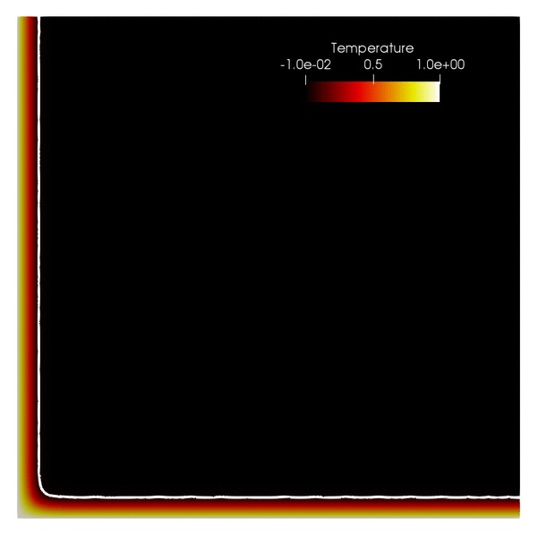
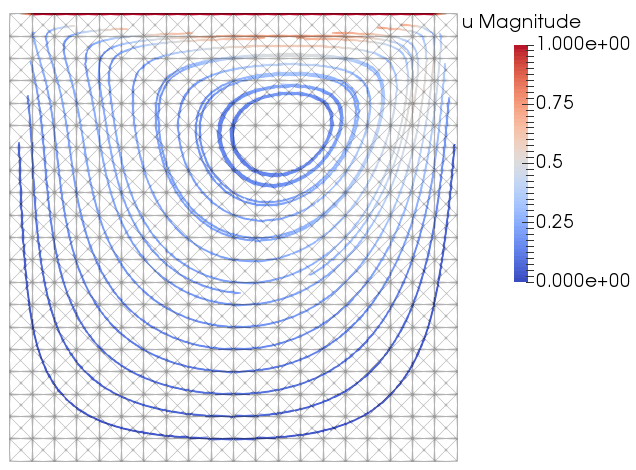
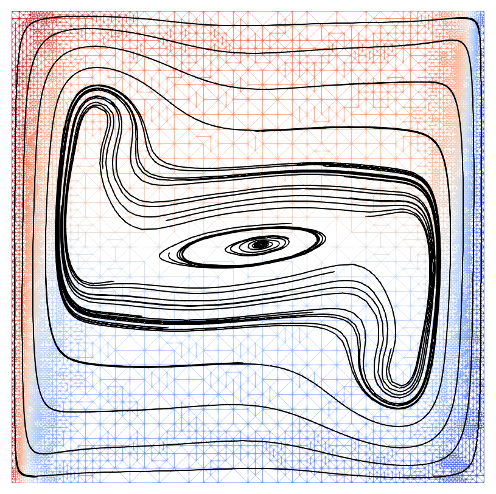
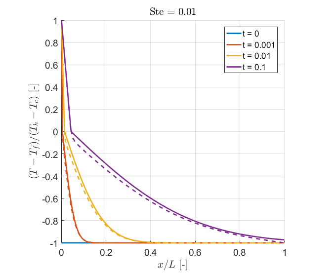

# phaseflow-fenics

FYI: The author's latest work on simulating convection-coupled phase-change with mixed finite elements is being captured in [Sapphire](https://github.com/geo-fluid-dynamics/sapphire).

Now here's an overview of Phaseflow:

Phaseflow simulates the convection-coupled melting and solidification of phase-change materials (PCM's). We adopt an enthalpy-based, single-domain semi-phase-field, finite element method, with monolithic system coupling and global Newton linearization. The governing equations are composed of
- Incompressible flow driven by buoyancy: unsteady Navier-Stokes mass and momentum with Boussinesq approximation
- Convection-diffusion of the enthalpy field, with an enthalpy source term accounting for the latent heat of the phase-change material
- Convection-diffusion of a concentration field, e.g. for salt water or another binary alloy

Features include
- An extensible Python class for time-dependent simulations
- Checkpointing/restarting using HDF5
- Goal-oriented adaptive mesh refinement (AMR)
- Coarsening of time-dependent meshes via re-meshing and projection

Phaseflow spatially discretizes the PDE's with the finite element method, and to this end uses the Python/C++ finite element library [FEniCS](https://fenicsproject.org/). Many other features are provided by FEniCS, including the nonlinear (Newton) solver, goal-oriented adaptive mesh refinement, and solution output to HDF5, among others. Phaseflow has first and second order fully implicit time discretization methods, backward Euler and BDF2 respectively, and allows the user to easily implement their own method.

We present the mathematical model, the numerical methods, the Phaseflow implementation and its verification in a published proceedings paper, [*Monolithic simulation of convection-coupled phase-change - verification and reproducibility*](https://www.researchgate.net/publication/327146270_Monolithic_Simulation_of_Convection-Coupled_Phase-Change_Verification_and_Reproducibility_Proceedings_of_the_4th_International_Conference_on_Computational_Engineering_ICCE_2017_in_Darmstadt). Per the MIT license, you are free to use this code as you wish; but please do cite our paper if this is reasonable. This paper excludes the concentration equation, which is a new development and for which a new paper will be submitted soon.

Author: Alexander G. Zimmerman <alexander.zimmerman@aices.rwth-aachen.de>

## Benchmark results
- Lid-driven cavity

- Heat-driven cavity

    
- Stefan problem 

    
- Convection-coupled melting of an octadecane PCM

    
# For users:

## Run Phaseflow on Ubuntu 16.04 LTS    
Install FEniCS.

    sudo apt-get install software-properties-common
    sudo add-apt-repository ppa:fenics-packages/fenics
    sudo apt-get update
    sudo apt-get install --no-install-recommends fenics

Clone Phaseflow's git repository.

    git clone https://github.com/geo-fluid-dynamics/phaseflow-fenics.git
    
Run some of the tests.

    python3 -m pytest -v -s -k "lid_driven_cavity" phaseflow-fenics

Pro tip: Windows 10 now has the Windows Subsystem for Linux. Go to the Microsoft Store and Search "Ubuntu". As of this writing, this gives you a native installation of Ubuntu 16.04 LTS, and this works wonderfully well with FEniCS and Phaseflow.

## Run Phaseflow in Docker (e.g. on Windows, Mac, many Linux distributions)
The FEniCS project provides a [Docker image](https://hub.docker.com/r/fenicsproject/stable/) with FEniCS and its dependencies already installed. See their ["FEniCS in Docker" manual](https://fenics.readthedocs.io/projects/containers/en/latest/).

Get the [free community edition of Docker](https://www.docker.com/community-edition).

Pull the Docker image and run the container, sharing a folder between the host and container.

    docker run -ti -v $(pwd):/home/fenics/shared --name fenics quay.io/fenicsproject/stable:2017.2.0

Clone Phaseflow's git repository.

    git clone https://github.com/geo-fluid-dynamics/phaseflow-fenics.git
    
Run some of the tests.

    python3 -m pytest -v -s -k "lid_driven_cavity" phaseflow-fenics

## Visualizing results
While FEniCS has some nice standard visualization options inline using Python, Phaseflow (using built-in methods in FEniCS) typically writes solutions to the XDMF format, which stores the data using HDF5 and adds an XML interface so that the data can be properly parsed by common open-source visualization tools (e.g. [ParaView](https://www.paraview.org/) or [VisIt](https://wci.llnl.gov/simulation/computer-codes/visit/)).
    
# For developers:
## Project structure
This project mostly follows the structure suggested by [The Hitchhiker's Guide to Python](http://docs.python-guide.org/en/latest/).

## Guidelines
Mostly we try to follow PEP proposed guidelines, e.g. [The Zen of Python (PEP 20)](https://www.python.org/dev/peps/pep-0020/), and do not ever `from fenics import *` ([PEP 8](https://www.python.org/dev/peps/pep-0008/)).
